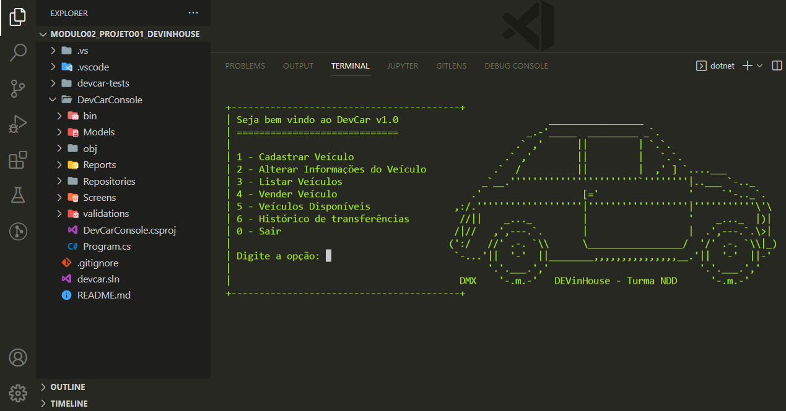

# Modulo02_Projeto01_DEVinHouse
Projeto Avaliativo 01 - Módulo 02 -  Desenvolvido para o curso DEVinHouse - Turma NDD🚀



<h2>🛠️ Tecnologias Usadas</h2>  
<ul>
    <li>C#</li>
    <li>.Net</li>
    <li>Projeto de teste xUnit</li>
</ul>

<h2>📦 Resultados de Desenvolvimento</h2>  
<ul>
    <li>O sistema desenvolvido em C# sendo projeto Console.</li>
    <li>O sistema contém um projeto de testes para xUnit.</li>
    <li>O sistema segue o Roteiro da Aplicação conforme passado.</li>
    <li>O desenvolvimento das mensagens de saída são mostradas no console a cada informação inserida por um usuário.</li>
    <li>Contem menus intuitivos no console, para fácil uso.</li>
    <li>Utilização de Herança, Polimorfismo e Encapsulamento.</li>
    <li>Criação de menu principal, menu de cadastro, me de listagens.</li>
    <li>Criação de Superclasse e subclasses com heranças.</li>
    <li>Criação de repositório para salvar novos cadastros.</li>
    <li>Implementação de metodos de Cadastro por categoria e alteração de cadastro</li>
    <li>Implementação de métodos de listagem de veiculos por categoria, vendidos, disponiveis e histórico de transferência</li>
    <li>Validação de valores de inputs e tratamento de exceções</li>
</ul>

<h2>✒️Autor</h2>
<h3>Edmilson Gomes 😊</h3>

## Como rodar o projeto?
### Você precisará:
<ul>
    <li>Visual Studio Code ou Visual Studio</li>
    <li>Git bash ou PowerShell </li>
</ul>

``` bash

#Clone este repositório no terminal:
$ git clone https://github.com/edmilsondmx/Modulo02_Projeto01_DEVinHouse

```
``` bash

#Execute os comando:

$dotnet restore
$dotnet build

#Pelo Visual Studio Code abra o bash e execute o comando:

$dotnet run --project ./DevCarConsole/

#ou PowerShell
$dotnet run --project .\DevCarConsole\

#Pelo Visual Studio abra o terminal e execute o comando:

$dotnet restore
$dotnet build
$dotnet run

```

``` bash


